# Job Log – Track Your Pipeline Without Losing Privacy


Job Log is a privacy-first job application tracker with built-in analytics and three usage modes so candidates, recruiters, and owners can all see what matters—without sharing sensitive data.

---

## Live Demo

| Layer | URL | Notes |
| --- | --- | --- |
| Frontend | https://joblog.zacknelson.dev | React + Vite deployed on Vercel |
| Backend API | https://joblog-api.onrender.com | FastAPI on Render (requires `?key=<admin>` for write access) |

> **Screenshots & Walkthroughs**  
> 📸 TODO: Add updated screenshots and a short GIF of mode switching + admin dashboard. Save media under `assets/` and link them here.

---

## Modes at a Glance

| Mode | Where data lives | Capabilities | Analytics | Ideal for |
| --- | --- | --- | --- | --- |
| **Public Demo** | In-browser `sessionStorage` seeded from `/src/mock/jobs.sample.json` | Explore UI, sort/filter, export CSV. Reset anytime. | Heartbeat + events recorded as `*_demo` | Recruiter quick look |
| **Personal (Local)** | Browser IndexedDB via `localforage`; JSON/CSV export for backups | Full CRUD, export/import JSON, backup reminders. No network writes. | Heartbeat + events `*_local` (anonymous) | Candidates tracking real applications |
| **Admin (Private)** | Render-hosted PostgreSQL via API key (`?key=...`) | Full CRUD against production DB, admin analytics dashboard | Heartbeat + events `*_admin` (admin-only view) | Owner reviewing real metrics |

---

## Key Features

- Instant mode switcher with onboarding modal and persistent preference.
- Rich job cards with status history, interview round tracking, tags, CSV export.
- Personal mode backup reminder + one-click JSON export/import.
- Anonymous analytics heartbeat/events with admin-only dashboard (per-mode breakdown).
- Tailwind-powered theme with live dark/light toggle.
- Local-first architecture that never leaks job data from non-admin modes.

<details>
<summary>More Feature Details</summary>

- Status history normalization keeps dates strict `YYYY-MM-DD` across API + UI.
- Tag editing, filtering, per-mode banners (cyan for personal, amber for demo).
- Admin-only Settings drawer actions: data clear, telemetry opt-out, reminder reset.
- `selectStore` abstraction chooses API vs IndexedDB vs demo seed automatically.
- 7-day trend visualization (Chart.js) for quick pipeline review.
- CSV exporter normalizes line breaks so spreadsheets stay clean.

</details>

---

## Tech Stack

| Layer | Tooling |
| --- | --- |
| Frontend | React 19, Vite 6, Tailwind CSS 3, Chart.js 4 (`react-chartjs-2`), localforage, Zod |
| Backend | FastAPI 0.115, SQLAlchemy 2, Pydantic 2, Uvicorn |
| Storage | PostgreSQL (prod), SQLite fallback (`jobs.db`) for local dev, IndexedDB (Personal mode), `sessionStorage` (Demo mode) |
| Deployment | Vercel (frontend), Render (backend + PostgreSQL), UptimeRobot (keep backend warm) |

---

## Architecture

```mermaid
graph TD
    app["React + Vite SPA\nModes: Demo / Personal / Admin"]
    sessionStorage[(Demo sessionStorage seed)]
    indexedDB[(Personal IndexedDB backups)]
    api["FastAPI /jobs · /analytics"]
    db[(PostgreSQL prod / SQLite dev)]

    app --> api
    app --> sessionStorage
    app --> indexedDB
    api --> db
```



---

## Anonymous Analytics

Job Log records only install-level metrics so you can benchmark engagement without exposing PII.

- **Heartbeat**: `{ id (UUID), mode (demo|local|admin), version, ts }` on launch.
- **Events**: `{ id, event }` for `job_create|job_update|job_delete|export_json|import_json` suffixed by mode (`job_create_demo` etc.).
- **Storage**: FastAPI tables `analytics_installs` and `analytics_events`; viewable only on the admin dashboard.
- **Opt-out**: Toggle in Settings, automatically disabled if the browser sends **Do Not Track** / Global Privacy Control.
- **Blockers**: Browser extensions (uBlock Origin, etc.) can suppress requests; the dashboard surfaces zero counts if blocked.

No job content, company names, IP addresses, or user agents are collected.

---

## Getting Started (Local Dev)

### 1. Clone & prerequisites

```bash
# macOS/Linux
python3 -m venv venv && source venv/bin/activate

# Windows (PowerShell)
python -m venv venv
venv\Scripts\Activate.ps1
```

### 2. Backend (FastAPI)

```bash
cd backend
pip install -r requirements.txt

# create backend/.env with
# API_KEY=<redacted>
# DATABASE_URL=postgresql://<user>:<redacted>@localhost:5432/joblog

uvicorn main:app --reload
```

If `DATABASE_URL` is omitted the API falls back to `sqlite:///./jobs.db`.

### 3. Frontend (React + Vite)

```bash
cd frontend
npm install
# .env.local
# VITE_API_BASE_URL=http://localhost:8000
# VITE_APP_VERSION=dev  # optional, defaults to "dev"
npm run dev
```

Visit http://localhost:5173. Admin actions require `?key=<API_KEY>` in the URL.

### 4. Useful scripts

```bash
npm run build    # production bundle
npm run lint     # eslint validation
```

---

## Configuration Reference

| File | Variable | Required? | Purpose | Example |
| --- | --- | --- | --- | --- |
| `backend/.env` | `API_KEY` | ✅ | Protect create/update/delete endpoints | `API_KEY=<redacted>` |
|  | `DATABASE_URL` | ⛔ (defaults to SQLite) | PostgreSQL connection string for Render | `postgresql://<user>:<redacted>@host:5432/joblog` |
| `frontend/.env.local` | `VITE_API_BASE_URL` | ✅ | Points UI to FastAPI (http://localhost:8000 in dev) | `VITE_API_BASE_URL=http://localhost:8000` |
|  | `VITE_APP_VERSION` | ⛔ | Displays build version in analytics payloads | `VITE_APP_VERSION=1.2.0` |

> Never commit real API keys or database credentials. Use `.env` and `.env.local` locally and configure secrets in Vercel/Render dashboards.

---

## Data & Privacy

- **Local-first**: Demo uses bundled JSON; Personal mode never leaves the browser; Admin mode talks to PostgreSQL via API key.
- **Backups**: JSON export/import accessible in Settings; reminder surfaces in Personal mode if no backup in 30 days.
- **CSV exports**: Available in every mode for quick sharing.
- **Limitations**: Personal data lives in one browser profile—export before clearing cache or switching devices.

---

## Folder Structure

```
joblog/
├── backend/
│   ├── main.py              # FastAPI entrypoint
│   ├── database.py          # SQLAlchemy engine + SessionLocal
│   ├── models.py            # Job + analytics tables
│   ├── schemas.py           # Pydantic models
│   └── requirements.txt
├── frontend/
│   ├── src/
│   │   ├── App.jsx          # Mode orchestration + analytics
│   │   ├── components/      # UI building blocks (AdminStats, JobForm...)
│   │   ├── context/         # ModeContext provider
│   │   ├── storage/         # API, IndexedDB, Demo drivers
│   │   └── mock/jobs.sample.json
│   ├── package.json
│   └── vite.config.js
└── README.md
```

---

## Roadmap

- [ ] Export anonymized analytics snapshot as CSV for recruiters.
- [ ] Add interview timeline visualization to complement the 7-day chart.
- [ ] OAuth-based admin login (replace querystring key).
- [ ] Scheduled Cloud backup for Personal mode exports.

---

## Changelog Highlights

- **2025-10** – Mode-aware analytics heartbeat/events + admin dashboard with per-mode buckets.
- **2025-09** – Introduced Personal (IndexedDB) + Demo (sessionStorage) modes with onboarding + banners.
- **2025-08** – Storage abstraction (`selectStore`) and JSON import/export with backup reminder.

---

## Attribution & License

Created by Zack Nelson. Licensed under the MIT License (add `LICENSE` file before production release).

---

## Badges Rollup

[](https://react.dev/)
[](https://fastapi.tiangolo.com/)
[](https://tailwindcss.com/)
[](https://www.postgresql.org/)
[](https://vercel.com/)
[](https://render.com/)

---

> Live stats (example): _2 unique installs • 70 launches • 7 total events_  
> (Real-time values appear on the Admin dashboard.)
